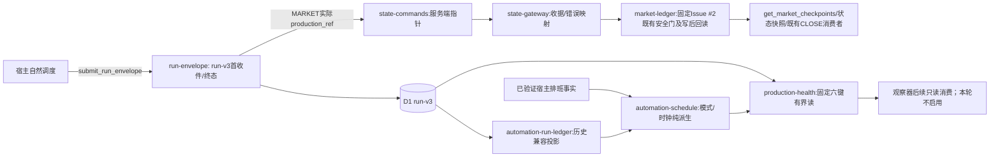

# 生产状态链、排班与健康读面修复实施计划

Spec: D:\quantpro-collector\docs\specs\2026-09-29-production-five-repair.md

## 问题与交付边界

在 `D:\quantpro-collector` 的 `6f13644eb36c8e4872d3774c9e91c7eca4767056` 基线上，**只拆** MARKET 日内 `production_ref` 与盘前 ref 等值硬拒，保留其余既有安全门；修正 condition_watch 整点假缺件、MARKET run-v3 版本丢失；提供 #50 固定六任务低成本只读聚合。交付为可实施的 Collector 源码/合成测试任务与独立部署/自然证据，不引入版本资格字段、比较判词、R4 版本门或新状态机。市场记录继续固定写 `zhushihao/quantpro-collector#2`；QMT 主库、交易执行、研究行情、六任务 Prompt 安装、宿主 Scheduler 配置、:55 观察器启停、GitHub 验收评论均不在本轮改动范围。研究机环境（`D:\QuantPro\.machine-role.json` 标记 RESEARCH/NON_LIVE）不能被视为交易机环境或线上部署证据。

需求背景见 [Collector #47 原评论](https://github.com/zhushihao/quantpro-collector/issues/47#issuecomment-5884163362) 与 [#50 固定六任务低成本聚合要求](https://github.com/zhushihao/quantpro-collector/issues/50)；技术范围以“不增加版本资格门，只拆盘前 ref 等值硬拒”为约束。D1 读量按 [Cloudflare D1 官方计费及 rows_read 口径](https://developers.cloudflare.com/d1/platform/pricing/) 核验。不采纳旧副本路径或未经原始日志验证的宿主停用/拦截原因。

## 架构及数据流

MARKET `records` 自然语言及其 Fresh-Delta 语句不是服务端版本资格结论，本修复既不算资格也不输出“可比性上限”。时间采用 ISO UTC 存储、Asia/Shanghai 固定 +08:00 判槽；只处理真实自然调用，合成数据用于自动测试，不构造或回填生产状态。每次 checkpoint 的 `production_ref` 和 run-v3 的本次 ref 为真实事实，非当前 Prompt/Worker 版本；成交、费用、滑点及训练集/样本外不适用于本次基础设施修复，实盘下单授权始终关闭。

## 接口冻结与冲突扫描

| 生产者 → 消费者 | 冻结的输入 / 输出 | 文件归属与冲突处置 |
|---|---|---|
| `run-envelope.ts` → `state-commands.ts` → `state-gateway.ts` → `market-ledger.ts` | MARKET 输入 `production_ref` 必为 40 hex；服务端仍据真实紧邻前序生成 comment 指针；持久化 payload 和回执**不增版本字段**，只去掉盘前 ref 等值拒绝 | `market-ledger.ts` 与 `tests/market-ledger.test.mjs`/`tests/market-ledger-cli.test.mjs` 由 MARKET 修改负责人独占；`state-commands.ts`/`state-gateway.ts` 仅查现状及回归，不因版本差异修改。`run-envelope.ts` 属审计文件负责人。 |
| `market-ledger.ts` → `get_market_checkpoints` / `get_state_snapshot` / `validateCloseDependencies` | 既有已持久化 ref、comment 指针与记录原样可读；`validateCloseDependencies` 仍只检查同日 CLOSE、上日 CLOSE 与同符号持续确认，没有 ref 相等门 | `state-gateway.ts` 与 `tests/state-gateway.test.mjs` 本轮只做消费者事实审计/原行为回归；若真实消费依赖版本相等，记录未决产品依赖并停在规格层，不擅改 R4。 |
| 宿主已核设置 → `automation-schedule.ts` → `automation-run-ledger.ts` / 定时对账 | 只读区分可核的 exact/condition 与未知事实；exact 的 `MISSED_SLOT`、condition 的有证据超期或 UNKNOWN 只做观察，不是运行资格门 | 排班负责人独占两个源文件及 `tests/automation-schedule.test.mjs`、`tests/automation-run-ledger.test.mjs`。`automation-schedule.ts` 禁止反向 import `automation-run-ledger.ts`（现有模块初始化循环警示）。 |
| `run-envelope.ts` → D1 run-v3 → `automation-run-ledger.ts` / 聚合读层 | 首次合法 MARKET 信封 `prompt_version=production_ref`，包括后来 BLOCKED；相同 envelope 重放不改原 ref；其他通道/心跳可 null，历史 v2 原样 | 审计负责人独占 `run-envelope.ts` 和 `tests/run-envelope.test.mjs`；`automation-run-ledger.ts` 的投影由排班文件负责人整合，双方只共享既有 ref 列契约，不互改文件。 |
| D1 run-v3/v2、排班纯函数 → 固定聚合 → `index.ts` MCP | `get_production_health_snapshot` 无用户过滤参数，六项恰好是 #50 白名单；`effective_status` 与 `schedule_health` 分列，不能推断时为 null/UNKNOWN | 聚合负责人独占新增 `src/production-health.ts`、`tests/production-health.test.mjs`、`src/index.ts`、`tests/state-gateway-mcp.test.mjs`；先冻结排班和审计投影字段，后集成。 |
| 如需要新增索引 → D1 迁移与 bootstrap | 先利用 `automation_runs_v3_task_time`；确需索引时新增 `migrations/0015_production_health_indexes.sql`，同步 `automation-schedule.ts` bootstrap，而非改 0014 | 迁移文件与查询由聚合负责人主责；bootstrap 所在 `automation-schedule.ts` 必须交排班文件负责人整合，禁止并发写同一文件；迁移号先扫描，0015 被占用则先处理冲突，不直接套用编号。 |

`automation/control/production.json` 是旧部署观察台账，不能替代宿主保存正文或 Scheduler timing_mode；本轮不改它。`automation/observers/production-health.md` 是标明 `AUTOMATION_SEMANTIC_SNAPSHOT` 的语义快照，不是线上安装字节镜像；本轮不把它当作已安装的 Prompt，也不启用 `:55`。禁止编辑 `D:\QuantPro\cn-hk-quotes-mcp` 旧副本。无前端、共享生成类型或交易机代码改动。

### 发布前基线和环境

已知基线：`npm --prefix D:/quantpro-collector run type-check` 返回 0；`node --experimental-strip-types --test D:/quantpro-collector/tests/{market-ledger,automation-schedule,automation-run-ledger,run-envelope,state-gateway-mcp}.test.mjs` 对应 **57/57 PASS**（执行时在 Git Bash 中显式展开五个绝对路径，花括号表达式仅作缩写）；执行的是合成测试，不代表生产。`git -C D:/quantpro-collector status --short` 已有未跟踪 `package-lock.json`、`wrangler.deploy-no-vectorize.jsonc` 和旧规格文件；不覆盖/清理前两项，不把它们混入修复提交。计划落地前记录当前 `git rev-parse HEAD`、变更清单及各目标文件 hash，避免在其他并行变更上盲补。

后续基线命令（全使用绝对路径，Git Bash）：

- `npm --prefix 'D:/quantpro-collector' run type-check`：退出码 0；失败定位新增 TS 字段/消费者不一致。
- `node --experimental-strip-types --test 'D:/quantpro-collector/tests/market-ledger.test.mjs' 'D:/quantpro-collector/tests/automation-schedule.test.mjs' 'D:/quantpro-collector/tests/automation-run-ledger.test.mjs' 'D:/quantpro-collector/tests/run-envelope.test.mjs' 'D:/quantpro-collector/tests/state-gateway-mcp.test.mjs'`：旧基线 57 PASS，新增回归不减少旧用例。
- `npm --prefix 'D:/quantpro-collector' test`：完成全仓 Node 合成套件，无失败；不以历史固定总数代替新代码实际执行计数。

## 实施任务与独立验收

### T1 / P0 — MARKET 最小差分去除盘前 ref 等值硬拒

仅修改 `D:\quantpro-collector\src\market-ledger.ts` 及 `D:\quantpro-collector\tests\market-ledger.test.mjs`、`D:\quantpro-collector\tests\market-ledger-cli.test.mjs`；只读核查并执行 `D:\quantpro-collector\tests\state-commands.test.mjs`、`D:\quantpro-collector\tests\state-gateway.test.mjs` 回归。输入仍为 `MARKET_CHECKPOINT_INPUT_SCHEMA`、本次真实 `production_ref` 与服务端 `MarketCheckpointState`；输出仍为原持久化 payload/回执/只读检查点，没有新字段、版本资格判词或迁移。`D:\quantpro-collector\src\state-commands.ts`、`D:\quantpro-collector\src\state-gateway.ts` 不属于本任务修改文件。

步骤：先在合成评论夹具建 09:10 A→11:50 B→13:50 B→16:45 B、A→B→A 及 A→A，记录真实相邻前序、盘前指针与 ref；仅移除 `market-ledger.ts:612-621` 的盘前 ref 等值拒绝，不动前两项指针校验 `:597-611`、schema、`universe_transition`、幂等和写后回读。负控保留陈旧 previous/preopen、同槽不同数据/重放、ACTIVE 改而 hash 不变、坏 schema/身份/权限、GitHub POST/读回失败；跨版 A→B 必须自然形态合成落账，同版行为不变。对 `state-gateway.ts:417-453` CLOSE R4 只做现有依赖的事实测试：它要求当日与上日 CLOSE 同符号持续确认，**没有 ref 相等检查**；跨版 R4 若按原规则放行，作为未解决产品语义上报，不在测试中断言“应新拒绝”或添新门。命令：`node --experimental-strip-types --test 'D:/quantpro-collector/tests/market-ledger.test.mjs' 'D:/quantpro-collector/tests/market-ledger-cli.test.mjs' 'D:/quantpro-collector/tests/state-commands.test.mjs' 'D:/quantpro-collector/tests/state-gateway.test.mjs'`；预期只解除单项 ref 阻断、其余负控全绿且无新增资格字段。

### T2 / P0 — 排班模式与缺信封时钟

修改 `D:\quantpro-collector\src\automation-schedule.ts`、`D:\quantpro-collector\src\automation-run-ledger.ts`；修改 `D:\quantpro-collector\tests\automation-schedule.test.mjs`、`D:\quantpro-collector\tests\automation-run-ledger.test.mjs`。输入为已核 `central-policy` 宿主 `condition_watch`/每小时与历史运行 05:40:32+08、12:52:28+08 的事实和既有 `received_at`；其余五任务逐项只读核宿主 timing_mode/RRULE/enabled，未经核实的时序原样缺省，不从仓内整点种子推断。输出只是已有审计行的**只读**缺件/未知观察，不更改信封准入、FINAL 或生产 Scheduler 配置。

步骤：以已核宿主配置为测试输入，修正 `deriveMissedSlotsFromRows`、历史合并读与 `runScheduleReconciliation` 对 central-policy 的整点误派生；`resolveSlotBinding` 仅在现行逻辑会将条件任务错误绑定绝对槽位时作最小修正。D1 `SCHEDULE_SEEDS` 是 Collector 旧内部种子而非宿主调度真相，禁止将它推成新资格门；condition 超期只在 cadence/最近交件/宽限均有证据时纯派生，无证据或 lookback 截断返回 UNKNOWN。SILENT 心跳和实际收到的 BLOCKED/FAILED 仍作为收到的事实，但不伪作业务成功；迟到只修正派生展示、不覆写 FINAL。exact 的已核真实缺件独立测试，保留缺槽时 MARKET 的真实前序指针。时间矩阵覆盖 12:00..12:40 假漏、12:52 自然到达、跨日、截止边界、v2/v3 混合、晚到与失去锚点。命令：`node --experimental-strip-types --test 'D:/quantpro-collector/tests/automation-schedule.test.mjs' 'D:/quantpro-collector/tests/automation-run-ledger.test.mjs'`；预期 condition 不误报整点，可核 exact 缺件仍可见，结果不称 Scheduler 必未触发。若定时对账仍全表读过大，限制窗口并记录成本，不让只读快路调用扫描。

### T3 / P0 — MARKET run-v3 版本持久化与重放

修改 `D:\quantpro-collector\src\run-envelope.ts`、`D:\quantpro-collector\tests\run-envelope.test.mjs`；`automation-run-ledger.ts` 的历史展示由 T2 负责人整合。首收件 `channel_payload.production_ref` 是唯一版本来源。先在合法信封预留 UNKNOWN 行时写入 `prompt_version`，终态 UPDATE 保持原版本不被 COALESCE/重放覆盖；若读时自 `automation_runs_v3` 的 `prompt_version` 列投影，不再硬置 null。合法信封后续出现 BLOCKED/FAILED/UNKNOWN 的版本不因结果丢失；无效 payload、非 MARKET、心跳可 null；历史 v2 值不被当前部署版本反判。用同 envelope 幂等、插入竞态输家、重试 UNKNOWN、MARKET 失败与其他通道测试。命令 `node --experimental-strip-types --test 'D:/quantpro-collector/tests/run-envelope.test.mjs' 'D:/quantpro-collector/tests/automation-run-ledger.test.mjs'`；预期 run_id、ref 首收件稳定，状态派生/`fresh_delta_count` 原行为不变。该任务不能往信封 schema 新增模型自报版本。

### T4 / P1 — 固定六任务只读低成本健康聚合

新增 `D:\quantpro-collector\src\production-health.ts`、`D:\quantpro-collector\tests\production-health.test.mjs`；修改 `D:\quantpro-collector\src\index.ts`、`D:\quantpro-collector\tests\state-gateway-mcp.test.mjs`；确需新索引时新增 `D:\quantpro-collector\migrations\0015_production_health_indexes.sql`，由 T2 文件负责人同步 `automation-schedule.ts` 的 migration-less bootstrap。输入仅 D1 已存在行、已核 schedule 模式、Worker version/scopes；接口 `get_production_health_snapshot` 无查询入参，输出与规格六项固定顺序及最小字段一致，缺 STARTED、sibling 或本次实际 MARKET ref 证据时返回 null/UNKNOWN，不计算预期版本资格。`state:read` 拒权与旧 `get_automation_run_history` 保持独立；D1 quota/表缺失返回 `STATE_UNAVAILABLE/READ/retryable`，不是六个 FAILED。**不得调用会建表/建索引/播种子的 `ensureRunEnvelopeTables` 或 `ensureAutomationRunsTable`**；不能因接口看似只读却在读时执行 DDL/DML。

步骤：按六个固定 key 使用 `(task_name, received_at DESC)` 等已有索引做有界最新 v3 和必要 v2 锚点查询；SELECT 列白名单，不用全局两次千行 `SELECT *` 或每小时七天逐槽展开；需要补一个有界同窗兄弟查询时只在可证明身份一致的窗口内统计，不能推断则 null。用 `EXPLAIN QUERY PLAN` 与 Cloudflare D1 `meta.rows_read` 同负载基线/新路比较，记录 SQL、固定样本规模、前后值、索引命中及必要的单任务历史基线；非 D1 shim 可证明语义但不能代替 D1 行读量证据。限额耗尽/授权/无行/部分 v2/UNKNOWN 的合成负控还要断言 0 写调用（包括 DDL）和 0 GitHub 请求。`node --experimental-strip-types --test 'D:/quantpro-collector/tests/production-health.test.mjs' 'D:/quantpro-collector/tests/state-gateway-mcp.test.mjs'`；预期可发现单次调用、六项、成本明显下降且 D1 异常明确不可用。索引未证明必要时不添加迁移；当前 0013 是 retention、0014 是 v3，不覆写旧文件。

### T5 / P0 只读审计、P2 另行处置 — 外部验收边界

无 Collector 源码修改；只读取六个宿主保存 Prompt 正文与 Scheduler timing_mode/RRULE/enabled/last_run 原文、编译基准 `D:\quantpro-collector\automation\build_prompts.py` 与 `D:\quantpro-collector\automation\control\production.json`；记录每份 `UTF-8 bytes / chars / SHA-256 / production_ref / Automation ID`，对六任务逐项判 EXACT。自然两轮 run-v3 各任务分别留 run_id、实际 ref/时间/结果，不手动触发。当前静态编译件不证明线上正文是否相同；未取到正文和两轮自然证据保留 NOT_PROVEN，不能晋级控制台账为 EXACT。对于 GitHub 宿主评论，只读取原始宿主执行 transcript、目标 Issue 实际评论 URL/时间与现存 OPEN 状态；没有原始拒绝日志不能断言具体拦截策略/身份，不能用本地 `gh` 或 Collector D1 补录替代宿主安全门。`:55` 当前不启用，不编辑 `D:\quantpro-collector\automation\observers\production-health.md` 或宿主设置；后续使用新聚合接口的安装/开关/自然验收须另行确认。此任务无命令可以替代宿主页面原文；GitHub 只读 `gh issue view 10 -R zhushihao/quantpro-research --json state,comments` 只证明 Issue 状态而不证明宿主调用路径。

### T6 / P0 串行联调、隔离发布与回退

依次完成 T1/T2/T3 字段契约和互不冲突单测、集成 T4，再跑 `npm --prefix 'D:/quantpro-collector' run type-check`、`npm --prefix 'D:/quantpro-collector' test`。除新测试外必须回归 `tests/market-ledger-cli.test.mjs`、`tests/state-commands.test.mjs`、`tests/state-gateway.test.mjs`、`tests/automation-schedule.test.mjs`、`tests/run-envelope.test.mjs`、`tests/automation-run-ledger.test.mjs`、`tests/state-gateway-mcp.test.mjs`。确认输入/持久化 Zod schema、readback、真实 ref/前序指针、历史投影、六键只读、错误码、run-v3 写列一致；确认无版本资格字段、无 R4 新版本 gate；先扫描任何并行改动的 `git diff` 和迁移编号冲突，安全负控任何一项 FAIL 则停止，不发布。

仅在独立部署授权及前述门满足时按固定 SHA 单独发布 Collector Worker；保留上一可用 Worker version、schema 迁移状态与回退步骤，不能捆绑 Prompt、宿主 Scheduler、:55 开关、GitHub 写操作。部署只核 Worker version/build SHA/新工具可发现与 D1 schema，真实成功必须另等自然 A→B→B（及 CLOSE）评论、D1 receipt、run-v3 三方交叉对账；无自然切换不能人为制造。出现既有账本读回失败、同版链退化、成本上升或负控越权立即停止部署或回退 Worker 到前一版本；已写 GitHub 评论和 D1 迁移不删除/逆迁，回滚后跨版可能再次 BLOCKED，明确标 NOT_PROVEN 并待修订。同步本迭代未完成证据清单，不能以部署绿灯代替自然外部成功。

## 技术裁定、并行边界与成本权衡

- **决定：只拆盘前 `production_ref` 等值硬拒，其他链校验不变，也不建立替代版本资格门** — 原因：`src/market-ledger.ts:597-620` 真实前序/盘前 comment 指针与版本相等检查是独立条件；若扩大放宽会让伪造指针/成员进入固定账本，若新造版本状态则会重新无谓拦写。`src/state-gateway.ts:417-453` 的 R4 实际查 CLOSE 记录和持续确认但不比 ref；跨版 R4 的产品语义须如实向 Owner 揭示，不能暗加 gate。
- **决定：condition_watch 与 exact 分路，未证配置 UNKNOWN** — 原因：#47 中央政策宿主 RRULE/锚点与仓内 `SCHEDULE_SEEDS` 不同；若错以整点检测，会持续误告警并让异常归因落错 Scheduler。
- **决定：run-v3 版本来自本次合法 MARKET 信封** — 原因：D1 已有列而当前写入/投影都丢值；若反用当前 Automation 的 SHA，历史会被追溯误判。
- **决定：#50 有界只读、不复用运行时建表函数** — 原因：现有 history 双大查询和 lazy bootstrap 会放大 D1 rows_read/潜在写副作用；判断错误会让监控重引发配额故障。
- **决定：宿主 GitHub 原生安全门优先，不设计替代外发** — 原因：本地 `gh` 可用性不能证明后台授权；判断错误是安全门规避及虚假的外部验收。

T1、T2、T3 可在既有字段契约确认后按互不写同一文件的范围独立推进：MARKET 只改 `market-ledger` 与其测试；排班只改 `automation-schedule`、`automation-run-ledger` 与自身测试；run-v3 只改 `run-envelope` 与自身测试。T1 对 `state-gateway` 是只读消费审计及既有测试回归，不占用其源码；T4 新读模块/MCP 入口可先搭建固定查询，待 T2/T3 观察字段与 ref 写列稳定后顺序集成；T5 宿主只读取证可独立开展，真实自然验收须待独立部署授权后。`index.ts`、`automation-run-ledger.ts`、`automation-schedule.ts`、schema/迁移各有唯一文件负责人，不并发双写或对冲发布。开发成本以 MARKET 极小差分控制，运行成本为有界 D1 读且须 rows_read 实测，可维护性依托现有 TS/Zod/SQL 与已核宿主事实；不为未来扩展先造资格状态，六键扩容另起需求/成本评估。

## 风险、回退和未决条件

1. 宿主五个尚未核实的 timing_mode/RRULE：保持 UNKNOWN，不从 `production.json` 或旧探索文字填充；Collector 只能证明缺信封，无法判宿主未触发。真实配置缺证使相关生产排班验收 NOT_PROVEN。
2. 已有 09:10 旧版与 11:50/13:50 被拦的回执不能回写或人工修复；新版本只能验证后续自然样本，必要时等待下一次自然版本切换。
3. 运行时 bootstrap 若与新迁移/索引不一致会出现 migration-less 与已迁移两种行为；每种用合成 shim 与真实 D1 查询计划复核。D1 rows_read 未测时 #50 成本门 NOT_PROVEN。
4. GitHub 评论 POST 可能已成功但读回失败：receipt 应保持 UNKNOWN/可重试核对，禁止为追求绿灯重复评论；Worker 回滚只回代码，不删旧账。
5. 宿主拒绝原始日志与六份保存正文尚缺；保留 GitHub/EXACT 两门 NOT_PROVEN 或已有安全阻断，不将 `gh auth` 或静态编译件冒充外部成功。代理失败用量未知，不能统计为零。

## 验收门与证据记录

| 验收门编号 | 判定条件 | 验证方法 | 证据 | PASS 条件 | FAIL 或 NOT_PROVEN 条件 |
|---|---|---|---|---|---|
| G1 代码及 MARKET 合成 | 仅拆盘前 ref 等值硬拒，原安全门不变，R4 不加版本门 | 执行 T1/T6 定向/全套测试，核 A→B→B→CLOSE、A→B→A、A→A、坏指针/哈希/权限/回读及现有 R4 | 测试原始结果、源码差分、合成评论/receipt | 首 B 与 CLOSE 按真实 ref/指针落账且同版不退化，原硬门不变、无新增资格状态 | 残余等值硬拒或安全负控失效/新资格逻辑 FAIL；未测 NOT_PROVEN |
| G2 排班与审计 | 真 exact 漏件、condition 假漏区分，本次 MARKET ref 可回查 | T2/T3 假时钟、首收件/重放/v2 混合，结合宿主只读模式快照 | 六任务配置逐项来源、测试输出、run-v3 字段查询 | condition 无整点假漏、可核 exact 真漏可见、MARKET 合法 BLOCKED 仍有原始 ref、未知配置不假定 | 假告警或 ref 丢失 FAIL；宿主来源不足则对应生产配置 NOT_PROVEN |
| G3 #50 读成本/安全 | 固定六项低读量，拒权及零副作用 | T4 六项、零写/零 GitHub、D1 错误模拟、EXPLAIN 与 `meta.rows_read` 同负载比较 | 查询计划、rows_read 基线/新值、权限与副作用断言 | 无不必要全扫且读量明显下降，拒权和失败语义正确 | 读量不降/越权/读时写 FAIL；未取得可比计量 NOT_PROVEN |
| G4 生产部署 | 目标 Worker 上线且可回退 | 独立核已发布 Worker version/build SHA、迁移和 tools/list | 部署回执、只读 gateway/tool/迁移快照 | 运行版匹配目标 SHA、新入口真实可发现、回退可执行 | 不匹配 FAIL；无原始部署证据 NOT_PROVEN，代码完成不替代 |
| G5 自然 MARKET 外部调用 | 真实跨版写入并保持原安全门 | 自然同日版本转换和后续同版/收盘，读固定 Issue #2 与 D1 | 自然时间、评论 URL/id、receipt/run_id、真实 ref/指针 | 实际跨版新记录及后续同版记录按原 payload 持久化/回读，不因版本不等被拒 | 真写失败/伪造资格结论或原硬门退化 FAIL；无自然样本 NOT_PROVEN，合成不替代 |
| G6 六任务宿主 EXACT | 保存正文等于编译件且自然运行证据齐 | 各宿主保存正文 bytes/chars/SHA 与编译产物逐项比对，等待各两轮自然 run-v3 | 六份原文哈希、Automation ID、自然 run ids | 六项逐字节一致且两轮自然证据齐 | 任一不符 FAIL；缺任何正文/轮次 NOT_PROVEN，线上其他任务正常不替代 |
| G7 GitHub 宿主外部写 | 宿主安全授权且目标评论真实出现 | 宿主授权路径原始 transcript 与目标 Issue comment 只读双核 | 拒绝/调用原文、目标评论 URL、Issue 状态 | 安全门允许且对应评论真实出现 | 拒绝或评论缺失不得 PASS；原日志缺失 NOT_PROVEN；不绕路 |
| G8 :55 保持关闭 | 本轮观察器未启用 | 宿主 enabled 配置只读核验 | 配置快照及后续另行审批（若有） | 本轮仍 disabled | 擅启 FAIL；配置不可读 NOT_PROVEN |

G1/G2/G3 是实现及合成门，G4 是部署门，G5/G6/G7 是真实外部调用/宿主门，G8 是开关边界门；互不替代。验收证据缺失只记 NOT_PROVEN，不用推测填洞。