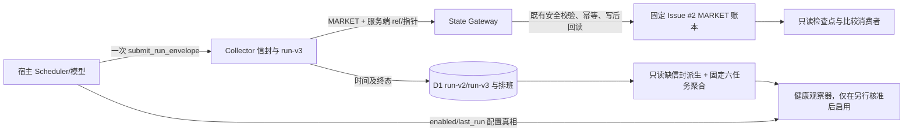

# 生产状态链与运行观察修正规格（2026-09-29）

## 问题、目标与边界

2026-09-29 的 09:10 PREMARKET 按旧 `production_ref` 入账，而 11:50/13:50 的新版本 MARKET 信封因与盘前版本不同被 `STATE_CHAIN_MISMATCH:VALIDATE` 阻断；同日 `central-policy` 的 `condition_watch` 运行被误套整点绝对窗口，提前派生 `MISSED_SLOT`；MARKET run-v3 未保存信封已有的版本字段。目标是**仅移除** MARKET 盘前 `production_ref` 等值硬拒，让真实日内版本变化按既有链持久化，保持 ref 原样、身份、真实前序/盘前指针、幂等、universe、授权和写后回读门不变；同时修正排班假缺件、记录 run-v3 实际 ref，并提供 #50 固定六任务低成本只读健康面。范围限 Collector 的 MARKET 写入、排班与运行审计及健康读面、相应合成测试与观察器消费事实。非目标：增加版本合格判断、`version_transition`/epoch、`STRICT`/`INCONCLUSIVE` 判词、R4 版本 gate 或服务端资格状态机；也不改交易决策或委托、重写 09:10 历史、人工补跑、重装六任务 Prompt、启用 :55 观察器、替代宿主 Scheduler 真相、绕过宿主 GitHub 安全检查或在本修复中发布 GitHub 评论。

基线是 Collector `main@6f13644eb36c8e4872d3774c9e91c7eca4767056`；需求背景见 [Collector #47 原修复评论](https://github.com/zhushihao/quantpro-collector/issues/47#issuecomment-5884163362) 和 [#50](https://github.com/zhushihao/quantpro-collector/issues/50)。本规格的业务边界是移除不必要的版本合格判断，不以跨版可比性判词或替代门重新阻断 MARKET。旧规格 `docs/specs/2026-09-29-envelope-spec.md:282` 的“prompt_version 恒 NULL”、`:367-387` 的所有任务绝对窗口与任一行判满，在本补充规格覆盖的条件下被取代；其余信封、账本、通知和权限约束不变。旧规格 `:363` 提及 0013 迁移号已与现状 `migrations/0014_automation_runs_v3.sql` 不符，以已部署迁移号为准，不重编号、不改旧迁移。

## 候选方案与裁定

| 方案 | 开发/运行成本 | 维护/扩展/熟悉度 | 结果 |
|---|---|---|---|
| A. 冻结当日版本，次日自然恢复 | 开发成本最低、当日停摆仍在；运行人工协调高 | 团队熟悉，扩展到日内发布能力为零 | 不满足 #47；仅回退期临时发布纪律 |
| B. 只移除盘前 ref 等值硬拒、其余链原封不动；复用现有 D1/TS 处理排班、审计与六键有界读 | MARKET 改动最小，读成本须实测；无需版本元数据/迁移 | 现有 TypeScript/Zod/D1 路径团队熟悉，维护面最小，可扩展但不提前设计资格状态 | **推荐：一个迭代用合成 A→B→B→CLOSE、安全负控与排班时钟证明核心假设** |
| C. 伪装旧 SHA 或放宽真实指针/授权，并用逐任务 history 全量扫描 | 看似快捷但运行扫描昂贵 | 隐瞒来源、污染审计和破坏跨任务扩展 | 禁止 |

技术裁定：删除 `src/market-ledger.ts` 中单独的盘前 ref 等值拒绝分支，**不**替换成任何“版本资格/可比”判断；错误代价是新门再次无故阻断或把真实 ref 隐藏。真实指针/成员/授权错乱继续硬拒，错误放宽会污染不可回滚账本。排班仅基于可核宿主事实修正误判，未知时不造绝对排班；健康面只读聚合，不引入缓存和资格状态机，D1 不可用时如实报不可用。

## 架构图与职责

`market-ledger` 独占 MARKET 链，维持现有服务端指针/安全检查而不增版本注记；`state-commands` 沿用真实版本和指针；`run-envelope` 独占 run-v3 本次信封 ref 的持久化、失败/重放语义；`automation-schedule` 和 `automation-run-ledger` 负责按可核排班事实派生缺信封与合并读，不创建“合格”状态；新聚合读层只查询六个固定 registry key，MCP `index` 只做窄入参与既有授权。宿主观察器只消费，不授予 Collector 修改 Scheduler 或向 GitHub 写验收评论的能力。QMT 主库仍是平台价格主源，市场观察本修复不引入外部行情、不改变数据冻结点、时钟为上海交易日槽位，测试一律合成，不引入成交、费用、滑点或训练集。

## 行为、接口与状态契约

### 1. MARKET 真实版本与既有持久化链（P0）

`submit_run_envelope.channel_payload` 不增字段，仍要求 40 位 `production_ref`；服务端如实保留本次实际 ref（不代表宿主已保存 Prompt EXACT）。只移除 `src/market-ledger.ts` 中 `checkpoint.production_ref !== state.preopen.payload.production_ref` 对非 09:10 的单项硬拒。**不以相邻 ref、盘前 ref、当天 epoch 或其他版本状态替换这一条拒绝**，不改 caller/persisted schema、回执形状或既有 `universe_transition`。当前槽已持久化时仍走原幂等重放/同槽冲突，A→B→A 也不可覆盖旧槽。未落账时原有 schema/身份、09:10 类型/日期槽位、真实 `previous_checkpoint_comment_id` 与 `preopen_comment_id`、ACTIVE 成员与哈希、授权及写后回读均保持。前序指向同日**实际持久化**的紧邻检查点，缺槽仍按现行语义处理，不可回指更早同 SHA 评论冒充前序；盘前指针仍指向真实 09:10。坏指针、重复槽/不同内容、非法 universe、错误权限、GitHub POST/回读失败均维持原 BLOCKED/FAILED/UNKNOWN 路径，失败不计 Fresh-Delta。

历史和新记录原样记录各自 `production_ref`；既有 `get_market_checkpoints`、`get_state_snapshot`、receipt 暴露的是已持久化事实，不返回新的 `version_transition`、epoch、`previous_comparison`、`preopen_gate`、`STRICT`/`INCONCLUSIVE` 或版本合格状态。成功持久化时既有 `fresh_delta_count=1` 仅表示一条新记录，不是版本比较通过。`records` 内的模型自然语言结论和 PREMARKET action_gate 也不是服务端证明的跨版本可比结论；消费者如需依赖该语义，应基于其真实读取内容另行揭示依赖并提交范围裁定，**本轮不得自行新增 R4 版本 gate 或代替模型判合格**。

已核消费链：`src/state-gateway.ts:417-453` 对 CLOSE R4 要求同日 `16:45` MARKET CLOSE 及同一符号的持续确认，正式 R4 还要求前一交易日 CLOSE 的同符号持续确认；当前实现检查记录与存在性，**未比较 `production_ref`**。放开 MARKET 写入会使不同 ref 的两次 CLOSE 仍按现有规则进入 R4 判断，这是须向 Owner 明示的真实下游语义与未决产品依赖，而非本次可借故增加的门。若业务方认定该语义不可接受，在 R4 产品规则另行裁定前不宣称跨版本持续确认已获验证；不可悄悄更改 R4 规则，也不可把 MARKET 落账回滚为旧版硬拒。测试须固定现有 R4 行为并证明 MARKET 修复未修改它，跨版本可比性本轮无 PASS/FAIL 服务端判词。

### 2. 排班、缺信封与审计版本（P0）

缺信封投影只区分可核实的绝对槽位（`exact_schedule`）、宿主条件/周期观察（`condition_watch`）与**未核实**的配置；这只是只读观察语义，不是信封或任务运行的新资格门。真实宿主 timing_mode/RRULE/cadence/enabled/锚点是观察依据，不从 `production.json` 中文“每小时”或 D1 的 `SCHEDULE_SEEDS` 虚构宿主绝对时刻。只有可核 exact 的 `[slot, slot+grace)` 完结且无交件才派生 `MISSED_SLOT`（仅指 Collector 未收到，不能断言 Scheduler 未触发）。已核 `central-policy` 为 condition_watch，其 `FREQ=HOURLY` 与历史 DTSTART 05:40:32+08、12:52:28+08 不支持推断 12:00 必达；需先取得可信 cadence/锚点/宽限证据才按实际最近交件推导超期 `FRESHNESS_OVERDUE`，否则如实返回 `UNKNOWN`，绝不判整点 `MISSED_SLOT`。其余五任务逐项核宿主信息；无证据时保留原 run 行和原始时间、只读派生未知，不写新的排班配置、资格状态或猜测时刻。交件的 SILENT、BLOCKED、FAILED 如实保留自身终态，不能把“已收到”误记成“业务成功”；晚到交件可修正派生展示但不改写 FINAL。合并读与定时对账使用同一有界派生口径；读时不落库、不加大范围扫表。宿主独立触发日志才可归因为漏调度。

MARKET run-v3 `prompt_version` 在合法信封首收件时由服务端从**该次** `channel_payload.production_ref` 写入现有 D1 列，即使后来链校验 BLOCKED 也保留收到的 ref；重放同一 envelope 返回原 run，不改变原 ref；非法 payload 不伪造版本；其他通道及空包允许 null，不据此判错版。`get_automation_run_history` 投影持久化字段而不是写死 null，旧 run-v2 保留原版字段。`prompt_version` 是实际 ref 事实，不是合格、同 epoch 或 EXPECTED 判词；不能用当前 Automation 版本倒灌过去历史 v2/v3。`COMPLETED` 仅表示成功持久化，`fresh_delta_count` 沿用既有新写入计数，通知文案不得冒充跨版资格验证。历史 v3 的 null 不倒填/猜测；能以唯一收据/账本交叉定位时仅在外部证据记录中标注，不直接改旧值。

### 3. 固定六任务健康读面（P1，#50）

新增只读 `get_production_health_snapshot`，无 task_name/since/limit 等可变大范围参数；沿用 state:read 实际授权判断。固定返回 `{status, as_of, collector:{cloudflare_version_id,state_read_authorized,d1_read_backend}, tasks:[六个]}`，每个含 `registry_key, latest_logical_slot_or_scheduled_for, latest_started_at, latest_final_at, effective_status, run_id, prompt_version, blocker_code, cloudflare_version_id, sibling_attempt_count|null, overdue_without_final|null, schedule_basis, schedule_health`；`schedule_health=ON_TIME|MISSED_SLOT|FRESHNESS_OVERDUE|UNKNOWN` 仅为观察展示、与原运行终态分列，不参与信封准入或状态写入；无宿主时序证据不能输出 ON_TIME/MISSED_SLOT/FRESHNESS_OVERDUE；`effective_status` 表示最新运行终态或有证据的 exact 缺件，D1 无行而无可信排班锚点时为 `UNKNOWN`。无法从 run-v3 唯一推导 sibling/STARTED/FINAL 时间时为 null，不得造零或以 received_at 假扮 STARTED；`schedule_basis` 说明 exact/condition/UNKNOWN 与所用锚点，非 MARKET 无已采集版本为 null。Collector 只陈述内部信封/审计状态，enabled/RRULE/last_run 仍由宿主读。对固定六 key 的最新有限窗口用索引友好 SQL/有界 limit，避免现有 history 的两次 1000 行表读与 7 天缺槽全展开；用 `EXPLAIN QUERY PLAN` 证明无不必要全表扫描、`meta.rows_read` 基线/新值证明明显下降。D1 异常返回结构化 `STATE_UNAVAILABLE/READ/retryable` 并判审计面不可用，**不是六任务失败**；此入口不得调用带 `CREATE TABLE/INDEX` 或 `INSERT` 的现有 `ensureRunEnvelopeTables`/`ensureAutomationRunsTable`，迁移未应用也应只读失败而不是读时建表。固定六 key 优先复用既有 `(task_name, received_at DESC)` 索引；如确需新索引须单独新增迁移，不改已部署 0014，并与运行时 bootstrap 兼容。不写 D1、GitHub、Automation，不启动扫描/重跑。旧 `get_automation_run_history` 保留。观察器 :55 保持停用；聚合接口即使上线也不自动启用。

### 4. 外部验收与宿主安全边界（P0 只读审计，P2 另案处置）

六任务 EXACT 验收需对每个 Automation 取得**宿主保存正文**的字节/字符/SHA-256 与编译产物对照，再核 `production.json` 和首两轮自然 run-v3；仓库静态编译/线上运行能证明部分契约生效，不能证明线上保存正文 EXACT，也不强行造两轮。未取到原文各项标 NOT_PROVEN，不据旧台账判当前装错。GitHub 接受性核验仅只读查看宿主原始调用/拒绝 transcript、请求是否发出、GitHub Issue 目标评论是否出现；目前 `quantpro-research#10` OPEN 且 2026-09-29 所需回写未出现，只能报告“未落账”；缺原始宿主日志不能宣称具体拦截机制。禁止以本地 `gh`、代理、内部 D1 或改写安全提示替代宿主安全门并冒称评论验收通过；若安全策略拒绝，记录 `HOST_SAFETY_BLOCKED/NOT_PROVEN` 与被拒步骤，保持 Issue OPEN 并交 Owner/宿主正规申诉或授权，不做自动替代外发。

## 测试矩阵、风险与回退

| 场景 | 合成预期 |
|---|---|
| 09:10 A→11:50 B→13:50 B→16:45 B；A→B→A / A→A | 每次以真实 `production_ref` 和真实前序/盘前指针写回读；A→B 不再因不等于盘前而拒，A→A 原行为不退化；没有任何 epoch/可比性判词 |
| 缺槽、重复同槽重放/冲突、错误前序/盘前指针、重复 key、ACTIVE 变更但 hash 不变、坏 schema/身份/权限、GitHub 中断 | 原先允许的缺槽仍按真实前序；重放不重复写；其他负控维持原阻断/不确定路径 |
| MARKET CLOSE → CLOSE R4（同版/跨版样本） | 固定现有同日与上一交易日 CLOSE 记录/同符号持续确认检查，不新增 ref 相等或“可比”门；跨版产品语义列为未决依赖，不凭测试宣称被认可 |
| exact 窗口到期/未到期；condition 12:00..12:40 与 12:52 envelope；迟到/跨日/无可信锚点 | exact 的真实缺件仍可见；condition 不报虚构整点假漏；超期须有真实 cadence/锚点，否则 UNKNOWN；无证据不判宿主漏调度 |
| MARKET 成功/BLOCKED/REPLAY、非 MARKET/空包、旧 v2 | actual ref 取本次合法信封且不可改；其余 null 可用；旧记录不被当前版本反判 |
| 健康六 key、无行、D1 不可用、读成本、权限 | 精确六项有界只读，未知为 null；不可用不伪报；未授权拒绝；索引和 rows_read 可核 |

发布隔离：先旧版合成基线与新增负控，再单独发布 Collector 更改；不得伴随 Prompt 或 :55 启停。若原安全负控退化、读面副作用或成本不可接受，停止发布/回滚 Worker 到前一可用版本，保留既有数据及已写 GitHub 评论，不做删除/覆盖或逆迁 D1；只读核对版本混合日的评论与收据。回滚旧 Worker 会重新硬拒跨版本，须将后续自然轮次如实记 BLOCKED/NOT_PROVEN，不能伪造修复成功。D1 行读取成本以 Cloudflare 官方 [D1 Pricing](https://developers.cloudflare.com/d1/platform/pricing/) 的 rows scanned 计量，按 `meta.rows_read` 比较；固定六项查询不能仅以返回六行宣称便宜。

## 验收门（分离证据，不相互替代）

| 门 | 判定条件 | 验证方法 | 证据 | PASS | FAIL / NOT_PROVEN |
|---|---|---|---|---|---|
| G1 代码/合成 | 仅拆盘前 ref 等值硬拒，A→B→B→CLOSE、A→B→A、A→A 与全部既有安全负控 | TS 检查、定向及现存套件；比对源差分、持久化原始 ref/指针、POST/回读 | 源码 diff、测试原始输出、合成评论和收据 | 跨版自然形态的合成写入成功、同版不退化，真实前序/盘前指针、幂等、universe、身份/授权、读回均未松动；无版本资格字段或 R4 新 gate | 任一硬门退化/残留跨版拒绝/新增资格逻辑 FAIL；未执行 NOT_PROVEN |
| G2 排班/审计 | exact 真漏与 condition 假漏分离，run-v3 本次 ref 持久化 | 合成时钟与 v2/v3 混合测试，逐任务只读核宿主配置真相 | 测试输出、宿主设置只读快照、run-v3 查询 | 可核 exact 真漏仍显、condition 12:40 不误报/12:52 如实记录、BLOCKED 有真实 ref、未知配置不臆测 | 假阳性/版本反判 FAIL；宿主模式或 cadence 不可核时对应生产判断 NOT_PROVEN |
| G3 轻量/安全 | 六 key 一次只读、索引与行成本下降 | EXPLAIN、D1 `meta.rows_read` 同负载前后实测与不可用模拟 | 查询计划、前后行数/计量、权限/无写测试 | 无不必要全扫且 rows_read 明显下降，拒绝无权读，失败不伪报 | 不降反增/写副作用 FAIL；无前后计量 NOT_PROVEN |
| G4 部署 | 构建代码真正服务线上且回退可执行 | 对照 Worker version、build SHA、工具 discoverability、D1 migration | 部署回执与只读 get_gateway_status | 版本一致，新工具可发现，回退路径演练 | 部署不同版 FAIL；无线上证明 NOT_PROVEN；不因代码 PASS 自动 PASS |
| G5 自然外部 | 真正跨版本 MARKET 落账且无盘前 ref 拒绝 | 等待自然新旧版本切换，按固定 Issue #2 评论、回执、run-v3 交叉对账 | 带时间/真实 ref 和真实指针的自然评论、receipt、run id | 自然首条跨版及随后同版如实持久化/回读，原安全门仍有效，无新增版本资格输出 | 真实写失败/伪造字段或安全门退化 FAIL；无自然样本 NOT_PROVEN，不人工补账 |
| G6 宿主 EXACT | 六任务安装正文与编译件一致、自然运行闭环 | 宿主保存正文逐任务 bytes/chars/SHA；首两轮自然 run-v3 核对 | 六份保存正文哈希、编译哈希、run ids | 六项逐字节一致且各两轮自然证据成立 | 不符 FAIL；缺任一宿主正文或轮次 NOT_PROVEN |
| G7 GitHub 外部写 | 宿主授权的目标评论真实出现 | 原始宿主调用日志与 GitHub 只读反查 | transcript、目标 Issue comment URL | 宿主安全门通过且对应内容真实落账 | 拒绝/无评论 FAIL 或安全阻断；缺原始日志 NOT_PROVEN；不能以本地替代渠道 PASS |
| G8 :55 启用 | #50 完成后才可另行决策 | 宿主 enabled 只读观察，另行明确审批 | 配置快照与审批记录 | **本轮 PASS 仅指保持 disabled** | 擅自启用 FAIL；无状态证据 NOT_PROVEN |

验收互不替代：G1 不证明 G4/G5；G4 不证明 G5/G6/G7；G3 不授权 G8。任一核心安全负控 FAIL 时不部署；G5、G6、G7 无实证如实保留 NOT_PROVEN。本轮不作生产成功宣称。
